# 
 <ins>Matplotlib Pymaceuticals Challenge</ins>

  What good is data without a good plot to tell the story?   In this assignment, I have applied what I have learned about Matplotlib to a real-world situation and dataset.
## <ins>About the challenge</ins>
  
  Assuming I am a senior data analyst who has just joined Pymaceuticals, Inc., a new pharmaceutical company that specializes in anti-cancer medication, was  given access to the complete data from their most recent animal study. The company recently began screening for potential treatments for squamous cell carcinoma (SCC), a commonly occurring form of skin cancer,  In this study, 249 mice who were identified with SCC tumors received treatment with a range of drug regimens. Over the course of 45 days, tumor development was observed and measured. The purpose of this study was to compare the performance of Pymaceuticals’ drug of interest, Capomulin, against the other treatment regimens.

The executive team had tasked me with generating all of the tables and figures needed for the technical report of the clinical study. They have also asked me for a top-level summary of the study results.
  
  The scripts will calculate and analyse the following:

* It will prepare the data.

* Generate summary statistics.

* Create bar charts and pie charts.

* Calculate quartiles, where it will find outliers, and create a box plot.

* Create a line plot and a scatter plot.

* Calculate correlation and regression.

## <ins>Observations and Insights</ins>
  
* After creating a clean data frame, I noticed that the treatment was carried on 248 mice; 51% male and 49% female; a difference of 2%, as seen in the pie chart plotting.

 
 <ins>Pie chart 1 created using the Pandas DataFrame.plot()</ins>

 
 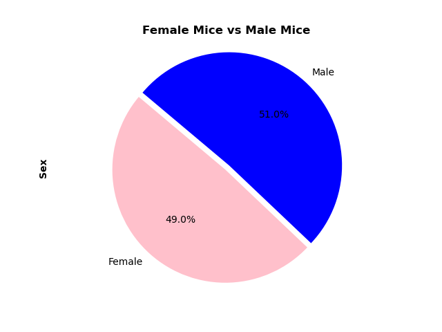

 <ins>Pie chart 2 created using the Matplotlib's pyplot</ins>
  
 
 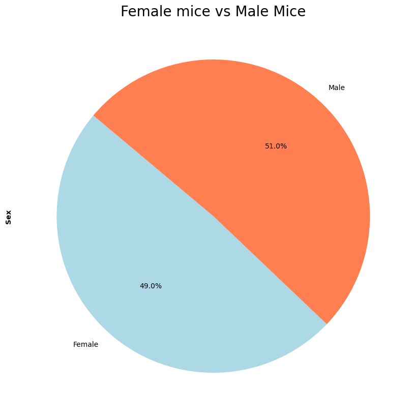

* Mice with SCC tumors received treatment with a range of different drug regimens. The performance of Pymaceuticals’ drug of interest, Capomulin, was compared against the other treatment regimens. There were 10 treatment regimens, as seen in the bar chart. As stated above, there was more focus on the Capomulin, followed by Ramicane and least focus on the Propriva.

 
 <ins>Bar chart 1 created using the Pandas DataFrame.plot()</ins>

 
 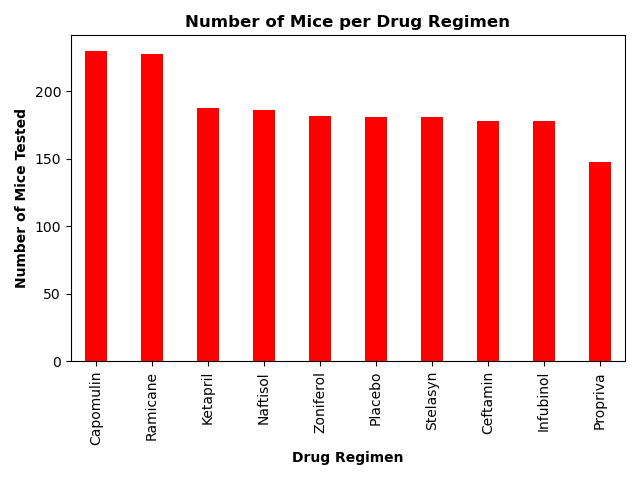

 <ins>Bar chart 2 created using the Matplotlib's pyplot</ins>
  
 
 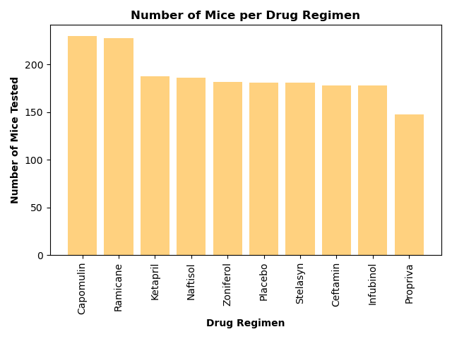

* According to the boxplot, the final tumor volume treated by Capomulin and Ramicane is smaller than the others. Although Ramicane seems to have a smaller final tumor volume, the number of mice treated by Ramicane is slightly less than Capomulin, only by a few. However, the median for both final tumor volume is very close; Capomulin has a median of 41.6 in comparison to the median of Ramicane which is 40.7. Plus, the mean is also very similar for the final tumor volume, when treated by Capomulin and Remicane (see Summary Statistics DataFrame below). In order to have a more accurate conclusion, the treatment of both regimens needs to be continued with the same number of mice, over the same time period. Only then can this be a fair test.

 <ins>Summary Statistics</ins>  
  
 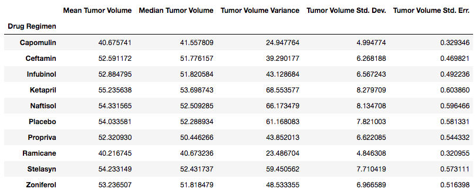
  
  
 <ins>Box Plot showing quartiles and outliers</ins>
   
 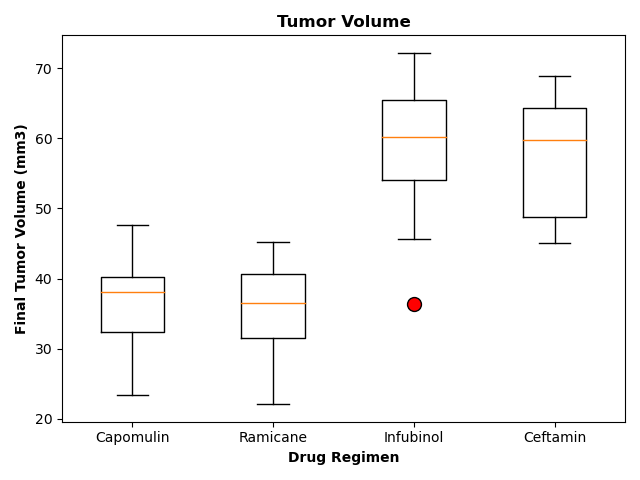
  
  
* Mouse ID l509 was treated by Capomulin. The tumor volume seems to decrease after around day 19. However, according the line graph, the tumor volume begins to increase again, after a few days of decreasing, especially at around day 35. The question here is – is the treatment effective enough? It would be interesting to compare this data with a mouse who was treated using Ramicane, to see on which day the tumor volume begins to decrease and if it does increase after a certain period of time. In order to see if this is the case, I decided to choose a mouse that had been treated with Remicane, who was also a male of a similar age and weight as mouse ID l509. I chose mouse ID y449 and mouse ID u196. See results in comparison to mouse ID l509. Although the tumor volume for mouse ID u196 increased after 20 days, both mice treated with Remicane, show a consistent decrease in tumor volume.

 <ins>Line Plot showing Capomulin treatment for mouse ID l509</ins>
   
 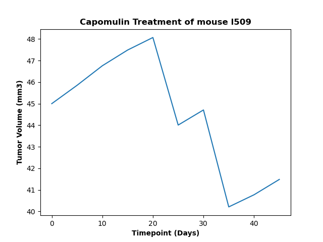

 <ins>Line Plot showing Ramicane treatment for mouse ID y449</ins>
   
 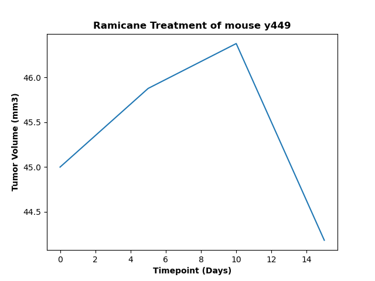

 <ins>Line Plot showing Ramicane treatment for mouse ID u196</ins>
   
 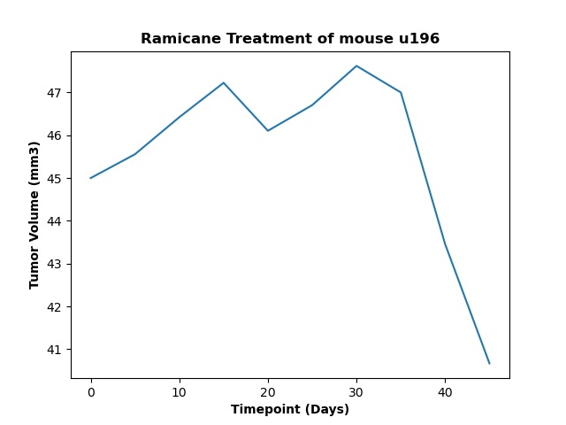

* There is a positive correlation between the average weight and final tumor volume which is 0.84, this shows there is a relation between the two variables. In addition, the r-squared which is 0.71 and shows that the final tumor volume could be predicted when looking at the average weight of the mouse.

  
 <ins>Scatter Plot</ins>
   
 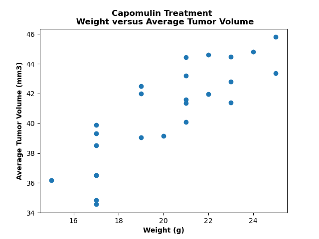
   
   
 <ins>Correlation and Regression</ins>
   
 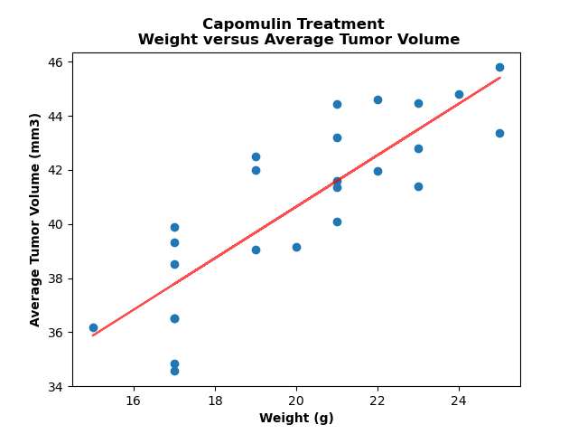
  
  
